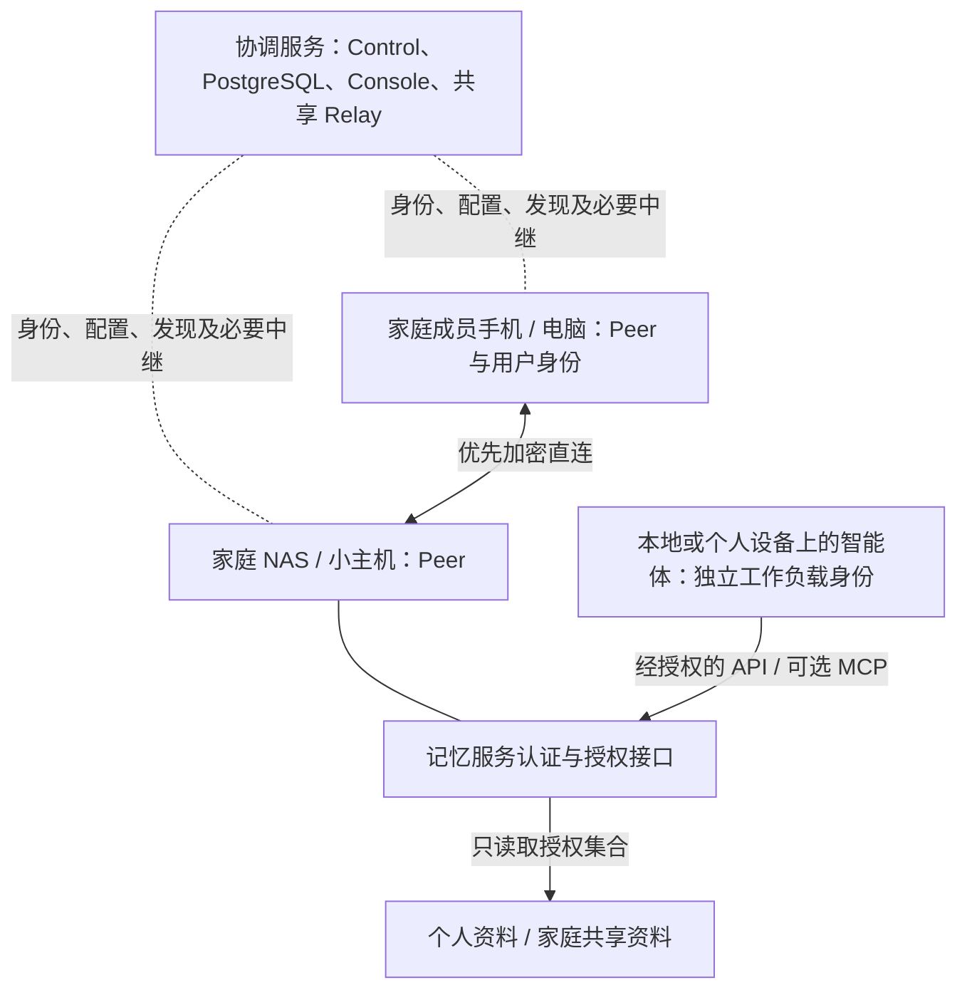

# Peerward：面向家庭智能体与记忆服务的私有网络

更新：2026-09-08。产品方向由用户提出；下文的对象模型、集成方式与首版范围为工程建议，
尚未实现，也不代表现有技术预览已支持家庭级资料授权。

## 产品定位

Peerward 连接家庭成员、设备、智能体和记忆服务，让个人信息在明确授权下被访问与使用。
长期对标 Tailscale、NetBird 的连接可靠性与使用体验，首批用户调整为个人与家庭，
优先邀请有 NAS、家用服务器或 Docker 使用经验的家庭参与试用。

本文的“记忆服务”指持久保存并提供照片、文档、笔记、个人偏好与智能体上下文的应用。
“记忆体”是用户拥有的这类数据与服务，不假设它必须使用向量数据库或某一家模型。

首个价值主张：人在外面，也能让自己的智能体访问家中允许使用的资料，知道引用来自哪里，
并随时收回后续访问权限。首版优先完成授权读取，随后再引入明确授权的写入与家庭自动化。

## 产品分工

| 层次 | 负责的事情 | 首版交付方式 |
| --- | --- | --- |
| Peerward 连接层 | 设备身份、Mesh、地址与 DNS、直连、中继、网络策略、状态诊断 | 复用并完善当前项目；继续评估 WireGuard 数据引擎 |
| 家庭与智能体授权层 | 成员身份、工作负载身份、委托、服务发现、授权撤销和访问事件 | 增加明确的产品/API 模型；应用级授权由服务或受控网关执行 |
| 记忆应用 | 原始资料、索引、检索、版本、内容级权限、导出与备份 | 接入一个可替换的应用，提供最小参考集成，不在 Relay 中构建存储或检索 |
| Agent harness | 驱动任务、工具调用、上下文与会话恢复、执行结果验证 | 通过受保护 API/MCP 与可替换适配器接入；外部运行，不加入核心 Relay |
| 智能体与模型 | 对话、工具选择、摘要、推理与动作 | 使用独立应用；网络不绑定模型供应商，用户选择本地或云端推理 |

组网保证资料可达，记忆应用承担内容正确性和持久保存。
Mesh 备份与恢复包只覆盖组网身份和相关状态，不能替代照片、文件、索引与应用密钥的备份。
云端推理会把实际提供给模型的内容送往模型服务；私有网络本身不保证处理过程全部在家中。
本地推理应作为可选部署路径，任何云端内容发送都应有清楚的配置与用户授权。

Harness 是本产品需要支持的应用运行系统。任务检查点、聊天摘要与家庭长期记忆分别管理，
更换 harness 不应改变资料所有权、成员授权或原文格式。用户指定的 claw-code 已完成局部源码核查，
当前作为适配研究对象；具体快照、MCP 路径限制和兼容验收见
[Harness 与 claw-code 接入规划](harness-integration.zh-CN.md)。

## 建议架构

控制服务默认仍可部署在云端，原始记忆及本地应用放在家中。
云端业务数据库保存网络/授权配置及必要事件，不默认存储家庭原文、向量或模型对话。
这不是“云端无信任”承诺：在线签发服务和密钥分发仍属于当前信任边界，Relay 仍能观察连接元数据。
需要完全本地控制时，将四核心服务放在家庭服务器；外网可达性和异地中继另行配置。

四个核心服务数量不随 Mesh 增减；家庭记忆应用和智能体是用户工作负载，可运行在自己的 Docker 中。
一个家庭可先对应一个 Mesh，个人与共享资料使用应用权限区分。
新增成员、资料集合或智能体不必创建新 Mesh，更不必增加一个核心容器。
同一 NAS 上的多个智能体不能共用一个万能应用令牌；设备身份与工作负载身份分别管理。

## 身份与权限模型

拟新增的对象与关系需要先完成 API/威胁模型设计，不直接等同于现有 Peer 记录：

| 对象 | 必须表达的信息 |
| --- | --- |
| 成员 | 谁拥有资料、谁接受邀请、谁能管理网络；网络管理员不默认获得每个人的内容授权 |
| 设备 | 哪台机器已加入、由谁管理、凭据是否有效；加入不自动发现或采集全部本地数据 |
| 智能体 | 独立服务身份、运行位置、负责人、是否代表某个成员执行任务 |
| 记忆服务与集合 | 服务地址、所有者、个人/共享范围、可用操作、来源与备份责任 |
| 授权委托 | 谁允许哪个智能体，访问哪个服务的哪些集合、执行哪些操作、何时到期及如何撤销 |

执行时同时检查设备网络权限、成员/智能体身份和服务的内容权限。
“允许 NAS TCP 443”只能证明网络可达，不能证明“允许读取共享相册但禁止读取私人笔记”。
现有 [`peerward-policy`](../crates/peerward-policy/src/document.rs) 是网络选择器与协议/端口策略，
新的内容权限不能靠标签、提示词或模型自觉来实现，必须在应用接口处强制校验。

同机部署时需明确容器文件挂载和凭据范围，防止智能体绕过 API 直接读取整个资料目录。
对有 NAS 管理员权限的攻击者，只有网络 ACL 不足以保护明文资料；更强隔离需要记忆应用提供
成员级加密和相应密钥管理，未实现前不作此承诺。

委托只授予已确认的读取或写入范围，不把“读取某份文档”扩展为任意工具调用。
将来支持删除、覆盖资料或外发内容时，由服务校验明确授权，并提供版本/恢复机制。
读取到的资料即使包含要求扩大权限的指令，也不能改变服务端的授权结果。

MCP 可作为可选集成协议；它不是网络隧道，也不是记忆数据库。
HTTP 授权集成应校验令牌的目标服务、作用域与有效性，不跨服务透传管理员令牌。
参考 [MCP 2025-06-18 授权规范](https://modelcontextprotocol.io/specification/2025-06-18/basic/authorization)
中的受众校验与令牌处理要求；具体实现前另行确定所支持的协议版本。

## 家庭长期使用必须明确的行为

- **个人与共享**：默认不因加入同一个家庭网络就共享私人记忆；成员主动选择共享集合。
- **本地与离线**：保留已确认的 Peer 离线直连规则，不新增强制短期在线许可。
  不能据此承诺设备重启、发现新节点或所有模型调用在云端离线时也能工作，需逐项验证。
- **应用授权期限**：委托到期属于记忆服务权限，不改变底层 Peer 的离线凭据规则。
  服务使用本地可验证状态执行授权；服务失联时，撤销何时生效要在界面和测试中说明。
- **撤销与遗忘**：撤销阻止后续获准访问，不能收回已经下载的内容；删除 Mesh 不自动删除家庭文件。
  资料删除、应用索引、备份保留与模型服务的副本按各自应用能力执行并报告结果。
- **来源与记录**：记忆应用返回来源标识、版本和时间；访问事件记录授权主体、操作及结果，
  不默认采集完整查询、文件正文或模型回答。成员可理解、导出并设置必要的保留范围。
- **备份与换设备**：迁移家庭服务器时分别恢复网络身份和应用资料；用原文校验与授权回归验证恢复。
  安装成功不能代替长期的数据恢复能力。

## 第一个可试用版本

配置为一台 Linux NAS/小主机、两名成员、手机与电脑、一个记忆服务和一个只读智能体。
该服务包含一个共享集合和两份成员私人集合；只使用用户明确选定的测试资料。
管理员提供设备可达的 HTTPS 加入入口；成员与智能体分别获取所需的身份和权限。

端到端验收故事：

1. 成员在移动网络下加入自己的家庭网络，不编译源码、不编辑隧道配置。
2. 指定记忆服务可用，并验证公开互联网无法绕过其身份与授权检查读取资料。
3. 成员授权智能体读取共享集合；智能体完成一个查询，应用返回可核对的资料来源。
4. 同一智能体读取另一成员的私人集合、尝试写入或拿错误受众令牌访问时均被服务拒绝。
5. 已连接的记忆服务收到撤销后，后续请求被拒绝；界面准确区分已生效与等待同步。
6. 家庭云端连接暂断时，验证仍在运行的本地连接与本地服务能否继续完成已授权读取，
   不把这项结果扩大为重启后完全离线可用。
7. 备份后在隔离环境恢复原文与组网身份，验证共享/私人权限未扩大、原文校验一致。
8. 至少一个实际 harness 通过适配器完成查询；暂停/恢复任务后重新检查授权，
   旧会话不能恢复已撤销权限，聊天摘要不自动写入长期记忆。

未通过这条完整链路前，不优先扩展多智能体自治、全屋信息采集、摄像头分析或硬件网关。
这条故事将成为产品验收入口；性能、实机、安全和稳定发布仍遵守
[产品化路线图](product-roadmap.zh-CN.md)与[发布证据规则](release-evidence.md)。
